# Workshop Overview
In this workshop you will build a voice powered analytic engine that you can take back to your stakeholders to deliver valuable company insights.   Common questions that may be asked, “Alexa, how many Unique Users did our site have last month?” and “Alexa, how many orders have breached their delivery SLA this week?”.

## Section 3: Alexa Skill Building

Note, that the following dependencies are needed in order to successfully complete this section of the workshop.

- [ ] Successful completion of Athena Query Building Section
- [ ] Amazon Developer account (free)
 
 
### Step 1: Setting up Your Voice User Interface
 
There are two parts to an Alexa skill. The first part is the Voice User Interface (VUI). This is where we define how we will handle a user's voice input, and which code should be executed when specific commands are uttered. The second part is the actual programming logic for our skill.   Both will be configured in this step-by-step guide. 
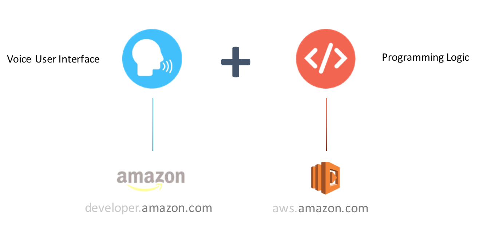  
  
Alexa fits into your Voice Powered Analytics architecture as the interaction interface for retrieving metrics.  Alexa determines what metrics to retrieve through intents (which we'll describe and configure in the next steps).  The intents correspond to metrics in your DynamoDB data store, which Lambda functions retrieve and send back to the Alexa-enabled device to communicate back to the user: 
 

<strong>Full solution - Setting up VUI (expand for details)</strong>
 
  
  1. Go to the [Amazon Developer Portal](http://developer.amazon.com/).  
  2. Click the **Alexa button** on the left portion of the screen. 
   
  3. In the top-right corner of the screen, click the **"Sign In"** button. 
  (If you don't already have an account, you will be able to create a new one for free.) 
  4. Once you have signed in, on the Alexa page, click the **"Alexa Skills Kit"** button, which is what we'll use to create our custom skill. 
  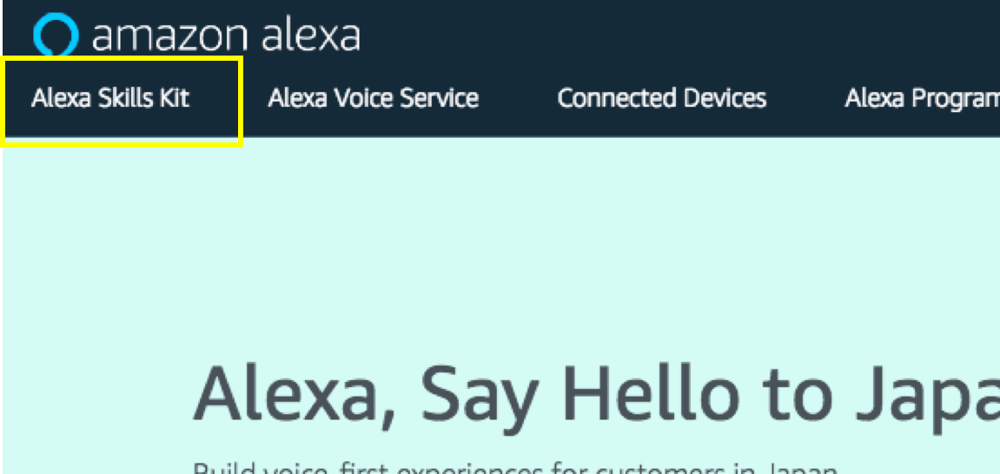 
  5.  Select **"Add a new skill."** This will get you to the first page of your new Alexa skill.
  6.  Fill out the **Skill Information screen**.  You can accept any defaults. Make sure to review the tips we provide below the screenshot. 
  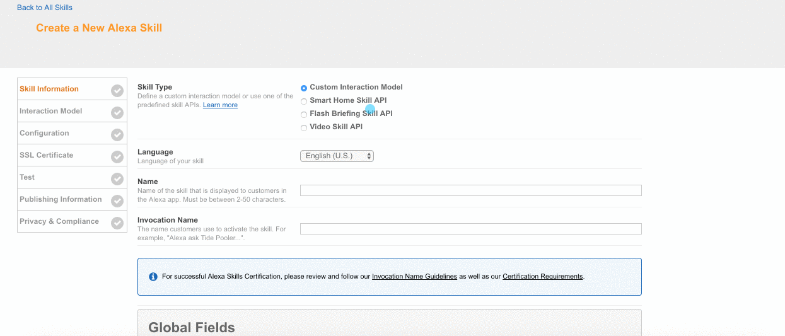 
  

 
<strong>Skill Information Tips (expand for details)</strong>

#### Skill Information Tips 
i.  **Skill Type** For this skill, we are creating a skill using the Custom Interaction Model. This is the default choice.
ii. **Language** Choose the first language you want to support. You can add additional languages in the future, but we need to start with one. (This guide is using U.S. English to start.)
iii.  **Name** This is the name that will be shown in the Alexa Skills Store, and the name your users will refer to.
iv. **Invocation Name** This is the name that your users will need to say to start your skill. We have provided some common issues developers encounter in the list below, but you should also review the entire [Invocation Name Requirements](https://developer.amazon.com/public/solutions/alexa/alexa-skills-kit/docs/choosing-the-invocation-name-for-an-alexa-skill).
<table>
<thead>
<tr>
<th>Invocation Name Requirements</th>
<th>Examples of incorrect invocation names</th>
</tr>
</thead>
<tbody>
<tr>
<td>The skill invocation name must not infringe upon the intellectual property rights of an entity or person.</td>
<td>korean air; septa check</td>
</tr>
<tr>
<td>Invocation names should be more than one word (unless it is a brand or intellectual property), and must not be a name or place</td>
<td>horoscope; trivia; guide; new york</td>
</tr>
<tr>
<td>Two word invocation names are not allowed when one of the words is a definite article, indefinite article, or a preposition</td>
<td>any poet; the bookie; the fool</td>
</tr>
<tr>
<td>The invocation name must not contain any of the Alexa skill launch phrases and connecting words.  Launch phrase examples include "launch," "ask," "tell," "load," and "begin."  Connecting word examples include "to," "from," "by," "if," "and," "whether."</td>
<td>trivia game for star wars; better with bacon</td>
</tr>
<tr>
<td>The invocation name must not contain the wake words "Alexa," "Amazon," "Echo," or the words "skill" or "app."</td>
<td>hackster initial skill; word skills</td>
</tr>
<tr>
<td>The invocation name must be written in each language you choose to support.  For example, the German version of your skill must have an invocation name written in German, while the English (US) version must have an invocation name written in English.</td>
<td>kitchen stories (German skill)</td>
</tr></tbody></table>
 
 
 
  7.  Click the **Save button** to move to the **Interaction Model**. 
  8. Click on the **Launch Skill Builder (Beta)** button . This will launch the new Skill Builder Dashboard. 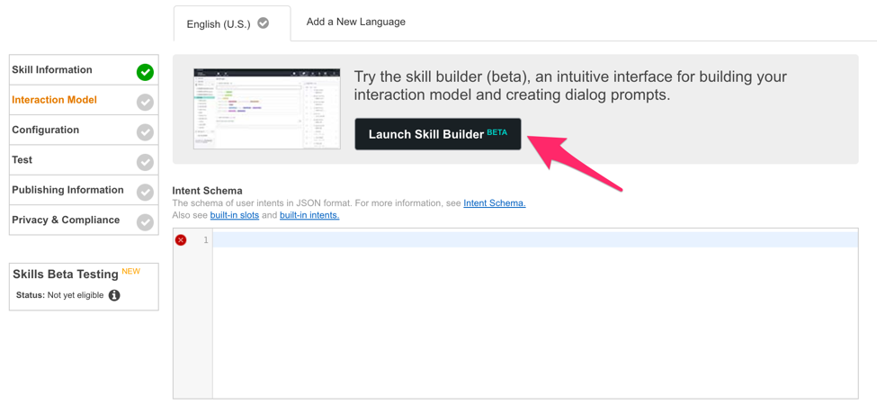   
  9.  Click on the **"Dashboard"** button.  
  10.  Click **"Add Intent"** on the Dashboard screen.  An intent allows you to define 'what to do' when your custom skill is invoked.  
  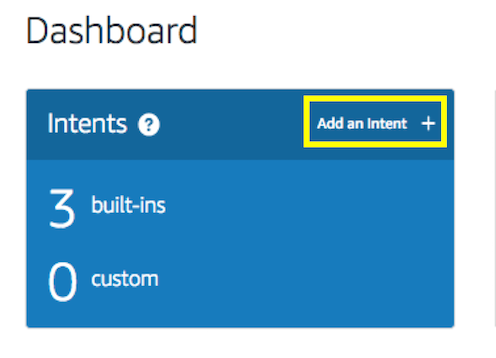 
  11.  Type in a name for the intent under **Create a new custom intent** 
  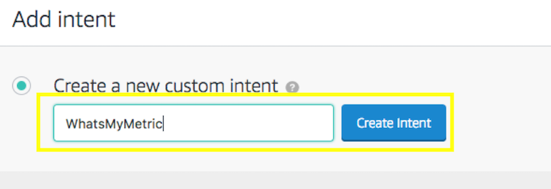 
  12.  Next we're going **Add utterances** to our intent.  This triggers an invoke of your intent through your user's voice.  You'll want to add a few different variations based upon how users will interact with the different types of metrics available to query.     
  - Some sample utterances for your newly generated intents. These are the things a user would say to make a specific intent happen. Here are a few examples:
    - *What's my {metric}* or *What is the value for {metric}* (More on what the *{metric}* means on the next step) 
    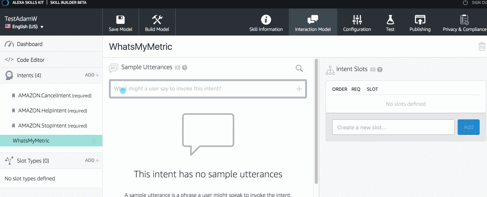 
  13. Now we'll **configure our Slots**.  Slots allow you to parameterize different variable attributes when invoking your intent.  For this workshop, the slot will be our metric(s) that we've created with the Athena query.  This is why we've put the {metric} slot name in our utterances.
    - Type in the name of the slot under **Create a new intent slot** and then **Click the + button** to add it.  Then click the **plus(+)** button on the utterances dialog to add the utterance.  Give your slot the name {**metric**}.  Note: If you want to give it a different name, then log the name in a separate text editor so we can adjust our backend Lambda function later.  If you do this, also remember to change the name of the slot referenced in your utterance so they match.        
    - Note: Alternatively, you can create a new slot on the right side of the screen in the section titled *Intent Slots*
  14. Our slot is now created and will be added to the *Intent Slots* area on the right side of the screen.  In this section, under the slot, click the area *choose a slot type*. We’ll create a new slot type for our list of metrics.  Let's call this **available_metrics** and click the **+** button to add it. 
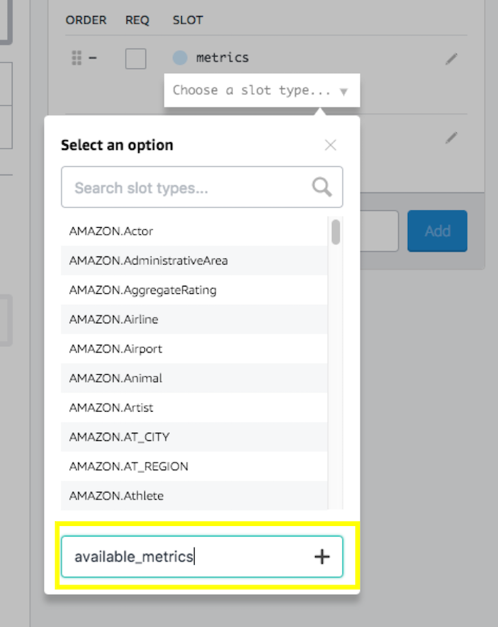 
  15.  On the bottom left side of the screen, click on the **available_metrics** slot type that was just created.   For the **slot value, enter the *value*** of the metric used from the *Athena_Poller* Lambda function's environment variable: *metric* (e.g. *reinvent twitter sentiment*. Then click the **+** button.  Note: The DynamoDB item that is used as our key in the backend lambda function uses this value to query our metric's value.
    - Note: Don't worry about adding **ID (Optional)** or **Synonyms**.  They can be added later after you test. 
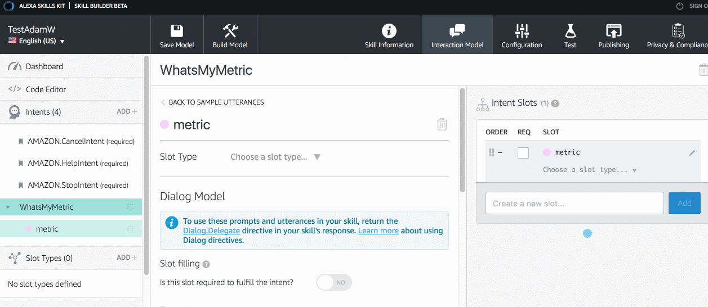 
  16. Now you're ready to Click **"Build Model"** and **"Save"** 
 
  17. If your interaction model builds successfully (You'll see a successful build message added to the dialog), click on **Configuration button** to move on to Configuration. In our next step of this guide (Configure Alexa Backend), we will be linking a Lambda function in the AWS developer console.  
 
 **Troubleshooting** If you get an error from your interaction model, check through this list:
   - Did you copy & paste the provided code into the appropriate boxes?
   - Did you accidentally add any characters to the Interaction Model or Sample Utterances?

### Step 2: Configure Alexa Backend
Now that we've configured the voice interaction, let's set up your Lambda function to be triggered by your Alexa Skills Kit and leverage your DynamoDB metrics. 
Note: When you ran the initial setup CloudFormation in Module 1, a Lambda function with the name starting with **::Stack Name::-AlexaMetricSkill** was deployed. 

 

<strong>Full solution - Setting up Alexa Backend (expand for details)</strong>

  
  1. Check your **AWS region**. For the reinvent workshop, we'll be using the **EU (Ireland)** region. 
 
  2. Open the Lambda function, starting with **::Stack Name::-AlexaMetricSkill** that was deployed with the Setup Cloudformation. 
  Then we'll **Configure your trigger**: Under Configuration, and in **Add Triggers** pane, select **Alexa Skills Kit** from the list. It will then add this trigger to your Lambda function. 
   
  2a.  Scroll down to **Configure Triggers**, click **disable**.   Note: optionally you can use the Alexa SkillID to lock down the lambda function to your specific Alexa Skill.   You can now scroll to the top of the Lambda function and click **Save** 
  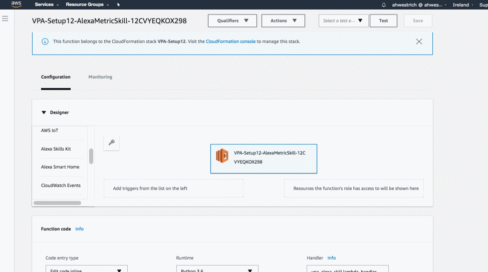  
  3. Once you have selected Alexa Skills Kit, click the **Configuration** Tab to go back to your code. 
  4. The *ARN value* should be in the top right corner. **Copy your Lambda function's ARN value to a separate text editor** for use in the next section of the guide.
   
  5.  Click on the **Configuration** tab, navigate to **Environment Variables**. 
  6. **validate/or change the environment variables**:  
    - **intent_name** matches what's configured for your *intent* in the Alexa Skill's Interaction Configuration 
    - **slot_name** matches what's configured for your *slot name* in the Alexa Skill's Interaction Configuration 
    - (Optional) You can modify the greeting and exit message for your Alexa skill by changing the value of two environment variables: **greeting_msg** and **exit_msg** 
  

Example
 
  
  greeting_msg *Welcome to the Voice Powered Analytics.  Please tell me what metrics you'd like to hear. To hear available metrics, ask Alexa tell me my metrics*  
  and
  exit_msg *Thank you for trying the Voice Powered Analytics.  Have a nice day!*

-  There's also an environment variable called: **metrics_table** with the value *VPA_Metrics_Table*.  This references the DynamoDB table that the Alexa skill will be querying for your metric

Hint
 
  
   

 
  
  
  7. **Bonus (Time permitting)**: can you add a skill to the Lambda function which enables users to "List My Metrics"

 
 
### Step 3: Connecting Your Voice User Interface to Your Lambda Function
In Step 1 "Setting up Your Voice User Interface", we created a voice user interface for the intents and utterances we expect from our users. On "Step 2 Configure Alexa Backend", we created a Lambda function that contains all of our logic for the skill. On this page, we need to connect those two pieces together. 

<strong>Full solution - Connecting VUI to Lambda (expand for details)</strong>
 
  
1.  Go back to the **[Amazon Developer Portal](https://developer.amazon.com/edw/home.html#/skills/list)** and select your skill from the list. You may still have a browser tab open if you started at the beginning of this tutorial.
2. Open the "Configuration" tab on the left side. 

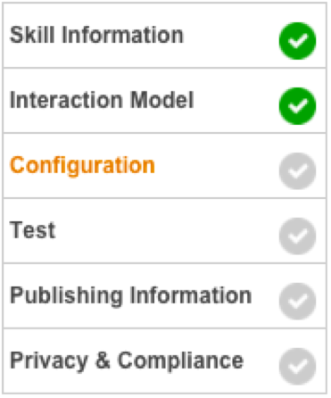 
 
3. Select the **"AWS Lambda ARN"** option for your endpoint. You have the ability to host your code anywhere that you would like, but for the purposes of simplicity and frugality, we are using AWS Lambda. 
- Notes: [Read more about Hosting Your Own Custom Skill Web Service](https://developer.amazon.com/public/solutions/alexa/alexa-skills-kit/docs/developing-an-alexa-skill-as-a-web-service). With the AWS Free Tier, you get 1,000,000 free requests per month, up to 3.2 million seconds of compute time per month. Learn more at [https://aws.amazon.com/free/](https://aws.amazon.com/free/). In addition, Amazon now offers [AWS Promotional Credits for developers who have live Alexa skills that incur costs on AWS related to those skills](https://developer.amazon.com/alexa-skills-kit/alexa-aws-credits)
  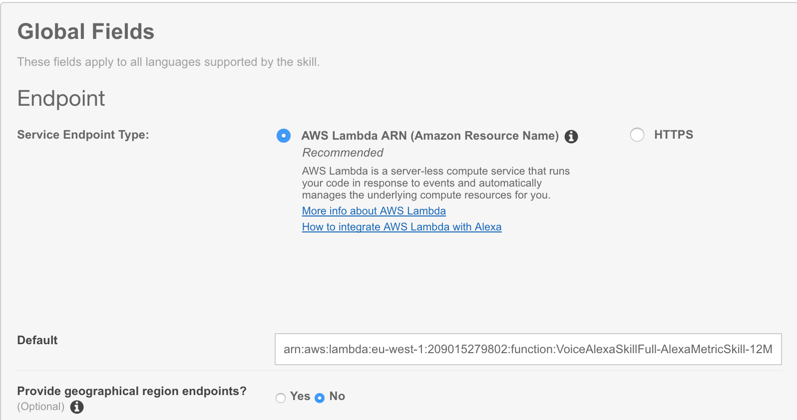 
4.  Paste your **Lambda's ARN** (Amazon Resource Name) into the textbox provided labeled "Default". It should look similar to the screenshot above.
5.  Leave **"Account Linking" set to "No"**. For this skill, we won't be using Account Linking, but you can learn more about [Linking an Alexa User with a User in Your System](https://developer.amazon.com/public/solutions/alexa/alexa-skills-kit/docs/linking-an-alexa-user-with-a-user-in-your-system) 
6.  Click the **"Next"** button to continue to Step #4 of this guide.

 
 
### Step 4: Testing Your Alexa Skill
You've now created a Voice User Interface and a Lambda function, and connected the two together. Your skill is now ready to test.*

<strong>Full Solution - Testing Your Alexa Skill</strong>
 
 
1.  In the **[Amazon Developer Portal](https://developer.amazon.com/edw/home.html#/skills/list)**, select your skill from the list. You may still have a browser tab open if you started at the beginning of this tutorial. 
2. Open the **"Test"** tab on the left side. 

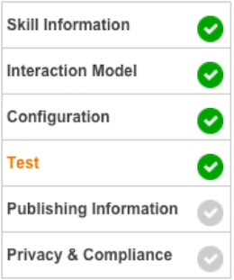 
 
3. Test your skill with the **Service Simulator**. To validate that your skill is working as expected, use the Service Simulator. In the **Enter Utterance** text box, type "What’s my reinvent twitter sentiment" 
  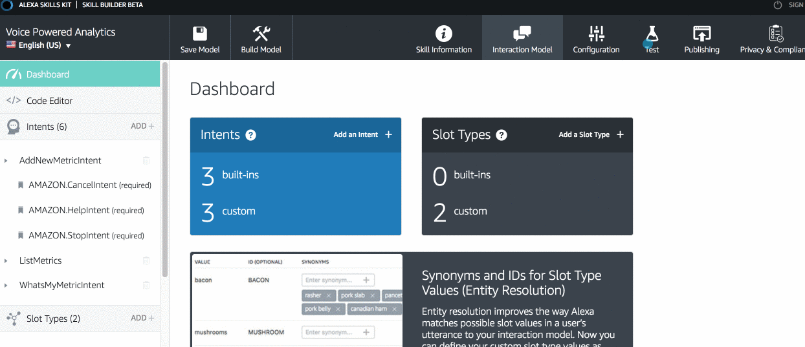 
4. Under the Service Response, you should see your metric's response under: *Response > Output Speech > Text*.  If you see errors, check out the **Troubleshooting** tips below.     
5.  Other testing methods to consider: 
- [Echosim.io](https://echosim.io/) - a browser-based Alexa skill testing tool that makes it easy to test your skills without carrying a physical device everywhere you go. 
- [Unit Testing with Alexa](https://github.com/alexa/skill-sample-nodejs-city-guide/blob/master/unit-testing.md) - a modern approach to unit testing your Alexa skills with [Postman](http://getpostman.com/) and [Amazon API Gateway](http://aws.amazon.com/apigateway). 
6. If your sample skill is working properly, you can now customize your skill. 
 
 #### Troubleshooting 
 - If you receive a response that reads: *"The remote endpoint could not be called, or the response it returned was invalid,"* this is an indication that something is broken. Copy the JSON from the Alexa skill and insert it as a test event to our Lambda function **VoiceAlexaSkillFull-AlexaMetricSkill-1**.  You can then see the specific output from the Lambda function as to why it is not executing successfully.
 - It is most likely due to either the Alexa Skills Kit: **slot name** or **intent name** does not match the Lambda environment variables. 
- Also make sure that the DynamoDB has an entry with a value for your metric. 
  
 
<strong>Service Simulator Tips</strong>
 
 
 - After you click the **"Ask [Your Skill Name]"** button, you should see the **Lambda Request and Lambda Response boxes** get populated with JSON data like in the screenshot above. 
 - Click the **Listen** button in the bottom right corner to hear Alexa read the response. 
 - You can have an entire conversation with your skill with the Service Simulator. Try the following commands: 
 - "what is my reinvent twitter sentiment" 
 (Continue this process for all of the utterances. To start over, click the "Reset" button.) 

  
 
### (Optional) Step 5: Deploy to Alexa For Business
To make the skill private for your organization.  You can optionally follow the following steps to deploy: [Alexa For Business](https://github.com/awslabs/voice-powered-analytics/blob/master/README-A4B.md)
 
 
### Bonus Step: What Utterances and Intents Are Needed For a "List My Metrics" skill
**Tweet @chadneal and @WestrichAdam** with a description of the custom skill that you've created from this workshop. It may be added below to our **Voice Powered Analytics Attendee Submissions** 

<strong>Hints and Attendee Submissions</strong>
 
   Intent: ListMetrics
   Utterance(s): 
   - ListMetrics List My Metrics
   - ListMetrics What are my metrics

